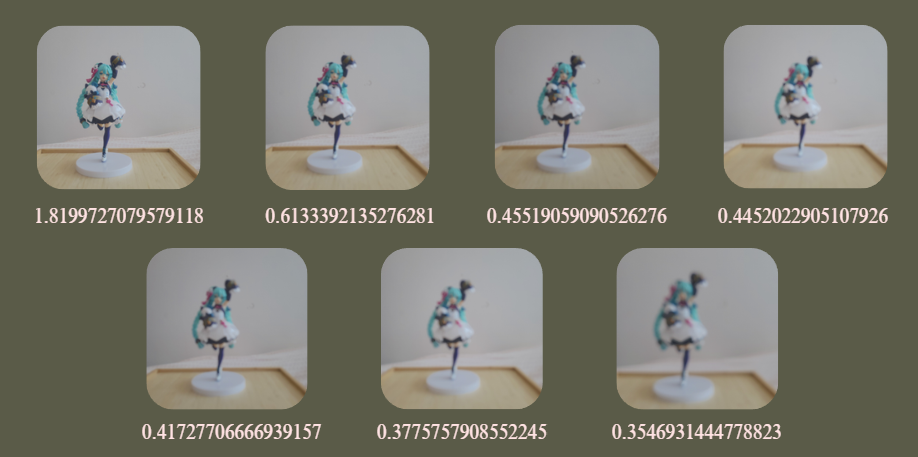

# Camera Autofocus — Image Sharpness Detection (Python)

> A Python tool that measures how sharp (in focus) an image is, using the variance of its gradient. This is the principle behind contrast-detection autofocus. It can rank a set of images from blurriest to sharpest.

## Description

This was an individual school research project (2024–2025) exploring how a camera focuses automatically, from two angles:

- **Physics**:  the optics of focusing (focal length, lens arrangement, Descartes' conjugation relation) and how they affect image sharpness.
- **Computing**:  detecting sharpness directly from an image, in Python.

## The method

A sharp, well-focused image has strong edges (big differences between neighbouring pixels). A blurry image has soft, weak edges. So the method used is the following one:

1. Convert the image to grayscale.
2. Compute the image gradient (differences between neighbouring pixels, horizontally and vertically).
3. Use the variance of the gradient magnitude as a sharpness score: high variance = sharp, low variance = blurry.

This is exactly how a contrast-detection autofocus decides when an image is in focus.

## Results

Running the analyzer on the same scene at different focus settings ranks the images correctly: the sharpest photo scores highest, meanwhile the blurriest scores the lowest lowest.

## Possible next steps

- The sharpness metric above is fully working.
- I also prototyped a live version on an ESP32-CAM (WiFi camera module) to adjust focus in real time, but couldn't get the video stream working — a natural next step.
- Possible improvement: vectorize the gradient computation with NumPy for speed.
